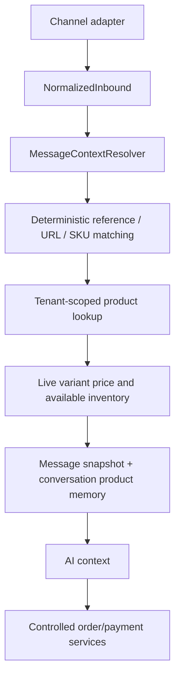

# Omnichannel Context Intelligence

Provider adapters retain reply IDs, attachments, shared-content references and a privacy-filtered provider payload. Catalog matching is centralized in `MessageContextResolver`, which tries tenant-owned external mappings, external product IDs, Vhicasar product URLs, SKUs and text metadata in that order. Every resolver query includes `organizationId`.

## Confidence and correction

- `PRODUCT_MATCH_AUTO_THRESHOLD` defaults to `0.90`.
- `PRODUCT_MATCH_LIKELY_THRESHOLD` defaults to `0.70`.
- Below the automatic threshold, AI is instructed to clarify and not create an order.
- An Inbox agent can correct a match. This updates conversation memory and saves a tenant-owned `ProductExternalReference` when provider reference data exists.

## Inventory safety

Context identifies products, but price and availability are refreshed from variants and stock levels before AI use. Enquiries never mutate inventory. The existing order service remains the only AI sales route and performs transactional availability checks and atomic stock reservation after explicit confirmation.

## Provider limitations

Capabilities are explicit per channel. Missing captions, thumbnails or IDs degrade to structured shared-media context and a clarification question. Visual inference is not performed unless a configured AI provider gains a reviewed image-input contract; opaque images never cause an invented product match.

## Deployment

The backend Docker entrypoint already runs `npx prisma migrate deploy` before starting. Migration `20260928150000_omnichannel_context_intelligence` adds the message context fields and external-reference table. The normal Prisma client generation step must also run.
